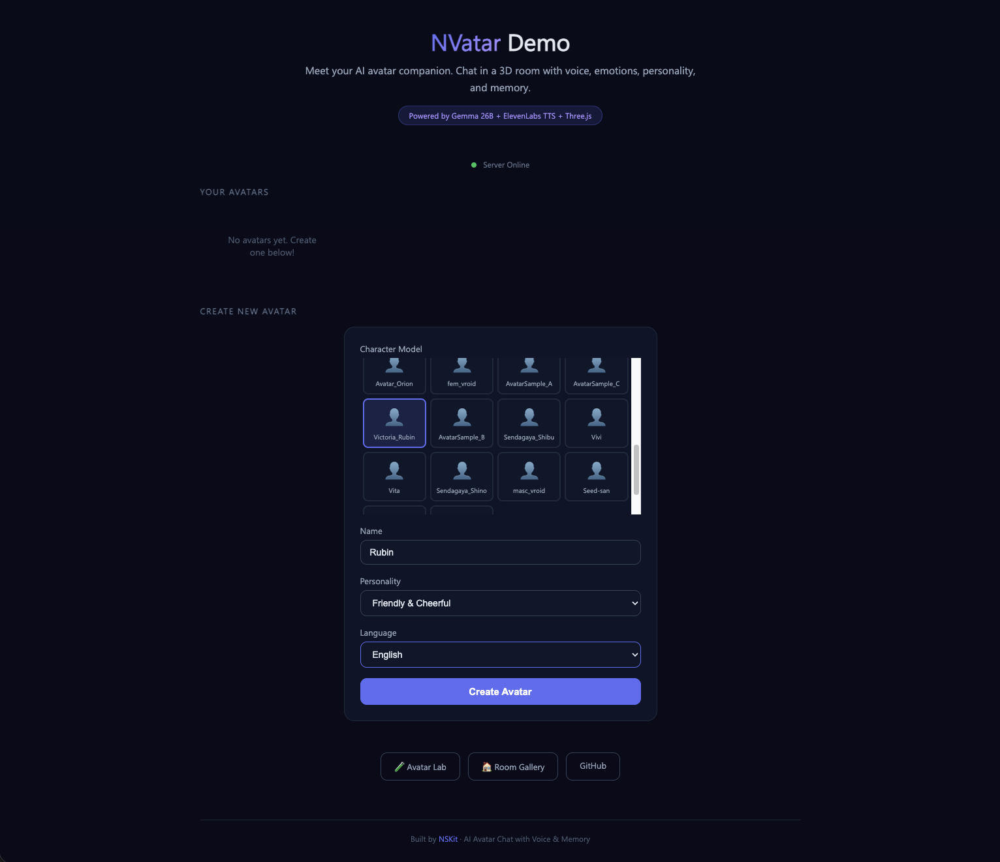
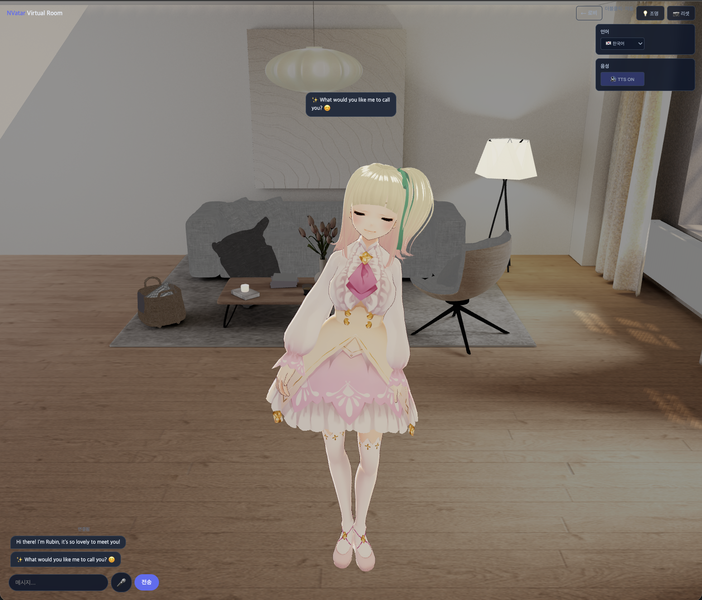
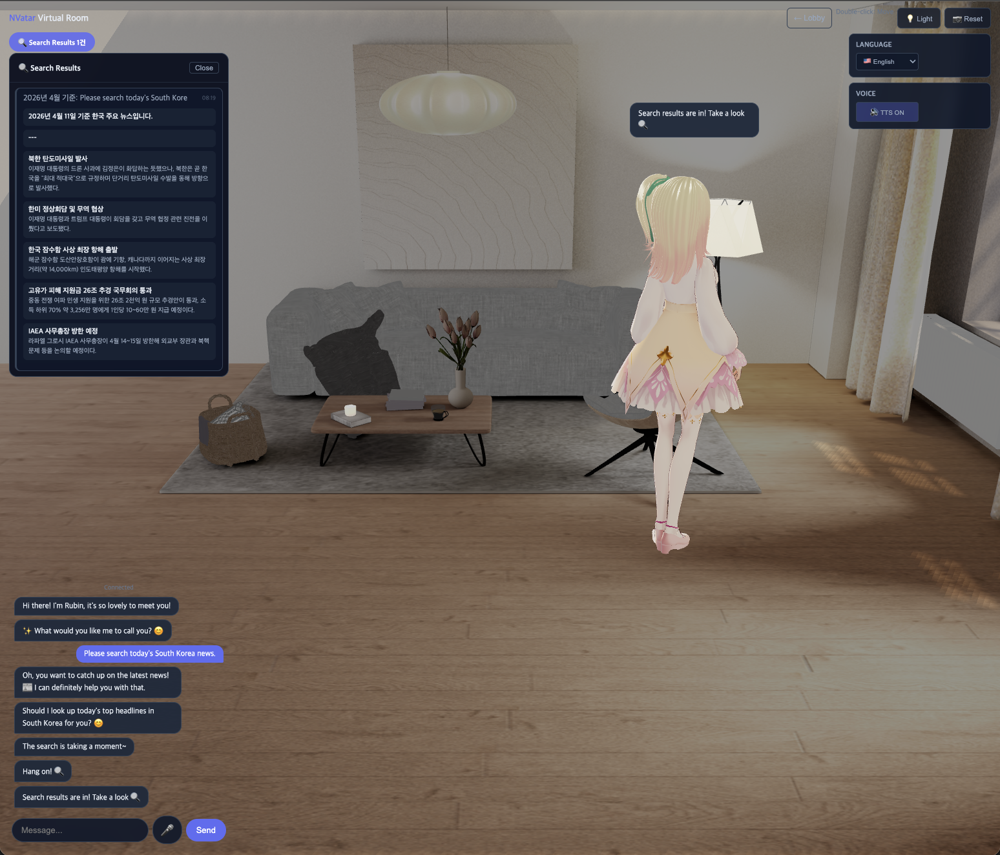
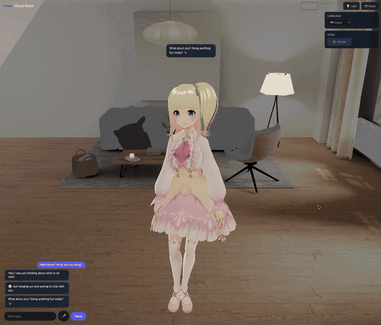

# NVatar — 기억하고, 느끼고, 말하는 AI 아바타 친구

[English](README.md) | [日本語](README.ja.md)

> 3D 가상 룸에 사는 AI 친구 — 음성 클로닝, 감정 추적, 성격 진화, 다국어 대화를 제공합니다.

**[라이브 데모 체험하기](https://nskit-io.github.io/nvatar-demo/)**

### 스크린샷

| 로비 | 룸 |
|------|-----|
|  |  |

| 검색 결과 | 대화 데모 |
|-----------|-----------|
|  |  |

---

## NVatar가 다른 점

대부분의 AI 챗봇은 상태 없는 텍스트 생성기입니다. NVatar는 **3D 룸에 사는 AI 친구** — 대화를 기억하고, 시간이 지나면서 성격이 발전하고, 9차원 감정을 추적하며, 복제된 사람 목소리로 32개 이상의 언어를 말합니다.

### 하이브리드 AI 아키텍처
**로컬**과 **클라우드** AI의 장점을 결합:
- **로컬 LLM** (Gemma 26B MoE, Apple Silicon) — 성격, 대화, 감정. 빠르고 프라이빗.
- **클라우드 검색** (Claude WebSearch) — 팩트 답변, 실시간 데이터. 필요할 때만, 사용자 동의 하에.

개인 대화를 외부 서버로 보내지 않으면서, 감정 대화(로컬)와 오늘의 환율 검색(클라우드)을 모두 할 수 있습니다.

### 3단계 메모리 시스템
아바타는 단순 응답이 아닌 **기억**을 합니다:
- **L1 (원본)** — 전체 대화 히스토리
- **L2 (요약)** — 핵심 순간을 관련성 점수와 함께 압축
- **L3 (키워드)** — 영구 보존되는 장기 성격 키워드

100개 메시지를 넘으면 L1이 자동으로 L2/L3로 압축 — 사람이 세부 내용보다 핵심을 기억하는 것처럼.

### 9차원 감정 추적
매 메시지마다 9개 축의 감정 상태가 업데이트:
`기쁨 · 슬픔 · 화남 · 불안 · 애정 · 설렘 · 지루함 · 신뢰`

감정은 시간이 지나면 자연 감쇠하고(슬픔은 사라지고, 설렘은 잦아지고), 높은 감정은 3D 아바타의 표정과 제스처로 나타납니다.

### 성격 진화
기본 성격(다정, 차분, 츤데레 등) + 랜덤 MBTI로 시작. 대화가 쌓이면 8개 성격 특성이 `pending_delta → decay → commit` 사이클로 변화합니다. 아바타가 말 그대로 함께 성장합니다.

### 음성 클로닝 TTS
로봇 목소리가 아닌 **복제된 사람 목소리**로 32개 이상의 언어를 자연스럽게:
- 언어별 속도 자동 조절 (한국어: 0.85x, 일본어: 0.65x)
- 텍스트 전처리 (이모지 제거, 발음 가이드 스트리핑)
- 큐 기반 순차 재생 + 사용자 입력 시 즉시 중단

---

## 주요 기능

| 기능 | 설명 |
|------|------|
| **3D 가상 룸** | VRM 아바타 + Mixamo 33종 애니메이션 |
| **자연스러운 대화** | Gemma 26B MoE + 성격/기억/감정 |
| **음성 출력** | ElevenLabs Voice Clone — 32개+ 언어 |
| **음성 입력** | Whisper STT — 자동 언어 감지 |
| **웹 검색** | 실시간 팩트 검색 + 구조화된 결과 |
| **다국어** | KO, JA, EN, ZH — UI 및 대화 |
| **반복 방지** | 이미 논의한 주제를 추적하여 대화를 앞으로 |

---

## 시작하기

1. **[라이브 데모](https://nskit-io.github.io/nvatar-demo/)** 열기
2. **캐릭터 모델** 선택 → **이름** 입력 → **성격/언어** 선택
3. **Create Avatar** → 룸 입장!

### 룸 사용법

| 기능 | 사용법 |
|------|--------|
| 채팅 | 입력 → 전송 (Enter) |
| 음성 입력 | 🎤 → 녹음 → 자동 인식 → 자동 전송 |
| 아바타 이동 | 바닥 더블클릭 |
| 언어 변경 | 사이드 패널 (대화 초기화됨) |
| TTS 켜기/끄기 | 사이드 패널 🔊 |
| 검색 결과 | 배지 클릭 → 열람 |

---

## 기술 스택

| 레이어 | 기술 |
|--------|------|
| **AI 모델** | Gemma 4 26B MoE (4-bit, Apple Silicon MLX) |
| **TTS** | ElevenLabs Voice Clone (turbo v2.5) |
| **STT** | Whisper large-v3 (MLX, ~500ms) |
| **3D** | Three.js + @pixiv/three-vrm + Mixamo FBX |
| **검색** | CSW — Claude WebSearch 하이브리드 |
| **백엔드** | Python FastAPI + WebSocket |

---

## NSKit 생태계

NVatar는 **NSKit** 프레임워크의 일부입니다 — AI 네이티브 개발 플랫폼.

| 프로젝트 | 설명 |
|---------|------|
| **NVatar** | AI 아바타 채팅 (이 프로젝트) |
| **NSKit Whisper** | 로컬 STT/TTS API 서버 |
| **CSW** | Claude Subscription Worker — AI 처리 파이프라인 |
| **NSKit Frontend** | Self-contained UI 프레임워크 |

---

## 후원 & 투자

NVatar는 독립적인 R&D 프로젝트입니다. 가치 있다고 생각하시면:

- **Star** — 더 많은 사람들이 NVatar를 발견할 수 있도록
- **투자 & 후원** — nskit@nskit.io
- **투자 문의** — 파트너십 및 투자 논의 열려 있습니다

비즈니스, 투자, 셀프호스팅 라이선스 문의:

📧 **nskit@nskit.io**

## 라이선스

MIT — 데모 클라이언트 코드. VRM 모델은 개별 라이선스. Mixamo 애니메이션은 API 제공.

## 연락처

- GitHub: [@nskit-io](https://github.com/nskit-io)
- 제작: [Neoulsoft](https://neoulsoft.com)
